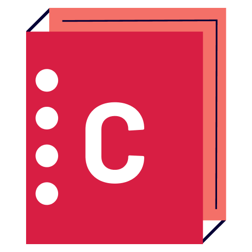

<a name="readme-top"></a>

<div align="center">
  
  <h1><b>Catalog of my things</b></h1>
</div>

# 📗 Table of Contents

- [📖 About the Project](#about-project)
  - [🛠 Built With](#built-with)
    - [Tech Stack](#tech-stack)
    - [Key Features](#key-features)
  - [🚀 Live Demo](#live-demo)
- [💻 Getting Started](#getting-started)
  - [Setup](#setup)
  - [Prerequisites](#prerequisites)
  - [Install](#install)
  - [Usage](#usage)
  - [Run tests](#run-tests)
  - [Deployment](#triangular_flag_on_post-deployment)
- [👥 Authors](#authors)
- [🔭 Future Features](#future-features)
- [🤝 Contributing](#contributing)
- [⭐️ Show your support](#support)
- [🔭 Acknowledgements](#acknowledgements)
- [❓ FAQ](#faq)
- [📝 License](#license)

<!-- PROJECT DESCRIPTION -->

# 🎯 Catalog of my things<a name="about-project"></a>

In this project, I develop a console app that enables users to keep track of their books, music albums, movies, and games. I use a UML class diagram as a blueprint to create elegant classes and methods. We also implement functionality to store data in JSON files and create a database with tables that match our app's class structure.


## 🛠 Built With <a name="built-with"></a>

### Tech Stack <a name="tech-stack"></a>

<details>
  <summary>Technology</summary>
  <ul>
    <li>Ruby</li>
    <li>PostgresSQL</li>
  </ul>
</details>

<details>
  <summary>Tools</summary>
  <ul>
    <li>VS Code</li>
    <li>GIT</li>
    <li>GITHUB</li>
  </ul>
</details>

<!-- Features -->

### Key Features <a name="key-features"></a>

This project is a simple catalog console app. The main features are:

- List all books
- List all music albums
- List all movies
- List of games
- List all genres (e.g 'Comedy', 'Thriller')
- List all labels (e.g. 'Gift', 'New')
- List all authors (e.g. 'Stephen King')
- List all sources (e.g. 'From a friend', 'Online shop')
- Add a book
- Add a music album
- Add a movie
- Add a game

<p align="right">(<a href="#readme-top">back to top</a>)</p>

<!-- LIVE DEMO -->

## 🚀 Live Demo <a name="live-demo"></a>

<!-- - [Live Demo Link]() -->

Sorr, Currently no active link available.

<p align="right">(<a href="#readme-top">back to top</a>)</p>

<!-- GETTING STARTED -->

## 💻 Getting Started <a name="getting-started"></a>

To get a local copy up and running follow these simple example steps.

### Prerequisites

you have to those tools in your local machine.

- [ ] Ruby
- [ ] GIT & GITHUB
- [ ] Any Code Editor (VS Code, Brackets, etc)

### Setup

Clone the project.

```bash
  git clone git@github.com:shahadat3669/catalog-of-my-things.git
```

Go to the project directory.

```bash
  cd catalog-of-my-things
```

In the project directory, you can run:

```bash
  ruby main.rb
```

For testing you can run:
```bash
  rspec ./space
```
<p align="right">(<a href="#readme-top">back to top</a>)</p>

<!-- AUTHORS -->

## 👥 Authors <a name="authors"></a>

### First Author:

**Shahadat Hossain**

[](https://github.com/shahadat3669) [](https://linkedin.com/in/shahadat-cseng) [](https://twitter.com/shahadat3669)

<p align="right">(<a href="#readme-top">back to top</a>)</p>

## 🔭 Future Features <a name="future-features"></a>

- [ ] **I will implement gui for it**

<p align="right">(<a href="#readme-top">back to top</a>)</p>

<!-- CONTRIBUTING -->

## 🤝 Contributing <a name="contributing"></a>

Contributions, issues, and feature requests are welcome!

Feel free to check the [issues page](../../issues/).

<p align="right">(<a href="#readme-top">back to top</a>)</p>

<!-- SUPPORT -->

## 👋 Show your support <a name="support"></a>

Give a ⭐️ if you like this project!

<p align="right">(<a href="#readme-top">back to top</a>)</p>

<!-- ACKNOWLEDGEMENTS -->

## 🔭Acknowledgments <a name="acknowledgements"></a>

- My Family.
- [Microverse Team](https://www.microverse.org/).


<p align="right">(<a href="#readme-top">back to top</a>)</p>

<!-- FAQ (optional) -->

## ❓ FAQ <a name="faq"></a>

- **Are you using database?**

  - No, I am not using any database.

- **Can I use this project for personal use?**

  - Yes, you can use it.

<p align="right">(<a href="#readme-top">back to top</a>)</p>

## 📝 License <a name="license"></a>

This project is [MIT](./LICENSE) licensed.

<p align="right">(<a href="#readme-top">back to top</a>)</p>
